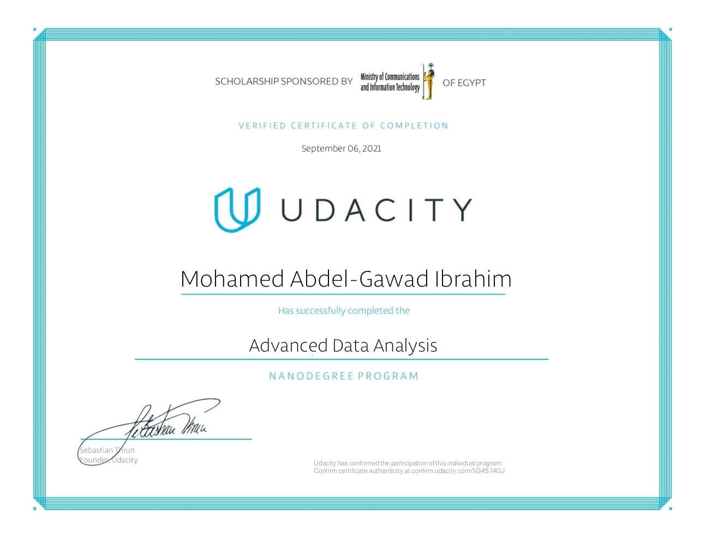

# Programme for International Student Assessment

## Dataset

> PISA is a survey of students' skills and knowledge as they approach the end of compulsory education. 

> It is not a conventional school test. Rather than examining how well students have learned the school curriculum, it looks at how well prepared they are for life beyond school. Around 510,000 students in 65 economies took part in the PISA 2012 assessment of reading, mathematics and science representing about 28 million 15-year-olds globally. 

> Of those economies, 44 took part in an assessment of creative problem solving and 18 in an assessment of financial literacy. 

> For simplicity, I extracted 8 columns that I am interested in, out of the original dataset, then saved this subset to local csv file.

## Summary of Findings

> * Students who doesn't enjoy math are studying more at home than other students who enjoy math!
> * Parents who like maths, their children study hours are more than the others.
> * Study hours tend to decrease when father employment's status goes through:
working full time > part time > other > looking for job
> * students study hours when mother is working are higher than when mother is not working!
> * Parents who agree to like maths, their children agree to enjoy maths
> * Parents who disagree to like maths, their children disagree to enjoy maths
> * Parents who strongly agree to like maths, their children strongly agree to enjoy maths
> * Parents who strongly disagree to like maths, their children strongly disagree to enjoy maths

## Key Insights for Presentation

> For the presentation, I focus on just the out-of-school study hours and its relationship with other variables. I start by introducing the individual variables, then plot their bar and pie graphs.

> Afterwards, I introduce each of the categorical variables one by one and its relationship with the main feature of interest, out-of-school study hours.

## Certification

> This project was a milestone in my journey to study the Advanced data analysis Nanodegree provided by Udacity.

## About The Author

* Author: Mohamed Abdel-Gawad Ibrahim
* Contact: muhammadabdelgawwad@gmail.com
* Phone: +201069052620 || +201147821232